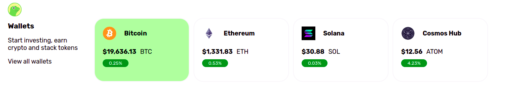

 ## UI-Components: Cards with embedded charts
 
Typically, KPIs are displayed in a group of cards. This app creates cards in a loop. It is generated dynamically from data using Bootstrap Utility classes and icons. It is updated with "live data" every 10 seconds (to stay within the free API tier).

Thanks to AnnMarieW for the idea

